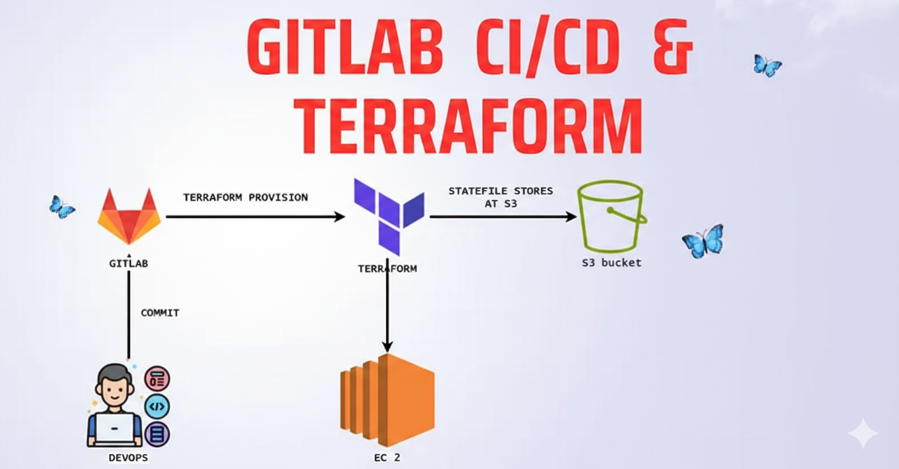

# Security-First CI/CD Architecture using GitLab & Terraform
### GitLab CI/CD + Terraform + AWS

## 📌 Overview

This project demonstrates a **production-grade CI/CD pipeline using GitLab**, combined with **infrastructure provisioning via Terraform**.  
The focus is on **automation, security, and repeatability**, following patterns commonly used in real-world enterprise cloud environments.

Infrastructure and delivery workflows are treated entirely as code, enabling consistent deployments and minimizing manual intervention.

---

## 🏗️ Architecture Diagram

## 🏗️ Architecture Summary

The solution follows a **layered and modular architecture**, separating concerns across:

- CI/CD execution
- Infrastructure state management
- Cloud networking and compute resources

Terraform is used to provision AWS infrastructure, including:
- Virtual Private Cloud (VPC)
- Subnets
- EC2 instances for application deployment

The CI/CD pipeline orchestrates the full lifecycle from validation to provisioning.

---

## ⚙️ CI/CD Workflow

The GitLab CI/CD pipeline performs the following high-level steps:

1. Source code changes trigger the pipeline
2. Terraform is initialized using a **remote backend**
3. Infrastructure plans are generated and validated
4. Infrastructure is provisioned automatically via Terraform

The pipeline is designed to be **environment-agnostic** and easily extendable for multi-stage deployments.

---

## 🔐 State Management

- Terraform remote state is **centrally stored in Amazon S3**
- Enables consistent state tracking across pipeline runs
- Supports safe collaboration and prevents configuration drift
- Remote state files are excluded from source control

---

## 🔒 Security Best Practices

Security is implemented as a **core design principle**, not an afterthought:

- **No hard-coded secrets**  
  All sensitive values are managed via secure CI/CD variables and environment variables.
- **Least-Privilege IAM**  
  IAM users and roles are created with minimal required permissions.
- **Separation of Duties**  
  Distinct responsibilities for CI/CD execution, infrastructure provisioning, and runtime access.
- **Repository Hygiene**  
  Sensitive files such as credentials, state files, and local overrides are excluded via `.gitignore`.

---

## 🚀 Key Features

- GitLab-based CI/CD automation
- Terraform-driven infrastructure provisioning
- Remote Terraform state stored in S3
- Secure IAM configuration following least-privilege principles
- Repeatable and auditable infrastructure deployments
- Designed for real-world, production-like environments

---

## 🎯 Purpose

This project was built to:

- Demonstrate **enterprise-level CI/CD and IaC practices**
- Showcase secure Terraform backend and IAM design
- Serve as a reusable foundation for scalable cloud infrastructure
- Reflect real-world DevOps and cloud engineering workflows

---

## 📌 Future Enhancements (Optional)

- Multi-environment support (dev / stage / prod)
- Manual approval gates for production deployments
- Private subnets with NAT Gateway
- S3 backend encryption and state locking
- Monitoring and logging integration

---

## 🤝 Feedback & Collaboration

Feedback, suggestions, and discussions around CI/CD architecture, Terraform best practices, and cloud security are always welcome.
